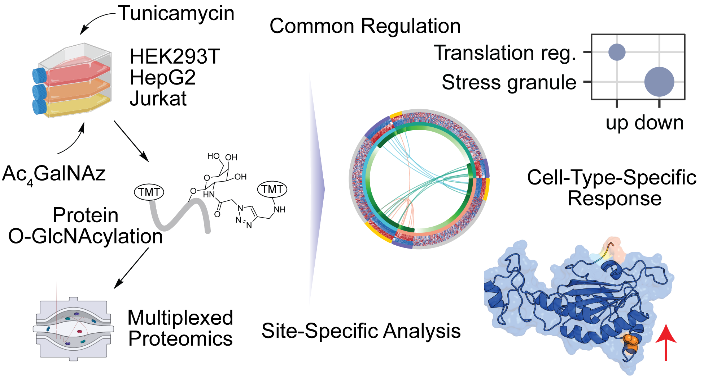

# Systematic Quantification of Protein *O*-GlcNAcylation under *N*-Glycosylation Inhibition

[](https://doi.org/10.1021/acs.analchem.6c00972)
[](https://doi.org/10.1021/acs.analchem.6c00972)
[](https://www.ebi.ac.uk/pride/archive/projects/PXD073249)
[](LICENSE)
[](https://creativecommons.org/licenses/by/4.0/)

Data-analysis code and figures for:

> **Longping Fu, Kejun Yin, Xing Xu, and Ronghu Wu.** *Systematic Quantification of Protein O-GlcNAcylation Reveals Common and Cell-Type-Specific Responses to N-Glycosylation Inhibition in Human Cells.* **Analytical Chemistry** 2026, 98, 15689–15699. DOI: [10.1021/acs.analchem.6c00972](https://doi.org/10.1021/acs.analchem.6c00972)

<p align="center">
  
</p>

## Introduction

Glycosylation is one of the most important and common protein modifications, and it plays vital roles in regulating protein activities and many cellular events. Unlike modifications with a single defined moiety, such as phosphorylation and acetylation, protein glycosylation encompasses structurally diverse modification types, including *N*-glycosylation, mucin-type *O*-glycosylation, and *O*-GlcNAcylation. Protein *O*-GlcNAcylation is a dynamic and reversible modification where a single monosaccharide, i.e., *N*-acetylglucosamine (GlcNAc), is bound to the serine, threonine, or tyrosine residue, predominantly on nuclear and cytoplasmic proteins. In contrast, protein *N*-glycosylation involves attachment of a preassembled core glycan to asparagine (Asn) residues in the ER, and this glycan is further elaborated in the ER and the Golgi apparatus, contributing to protein folding, trafficking, and regulation of many extracellular events.

The established role of protein *O*-GlcNAcylation in cellular stress responses suggests potential crosstalk between protein *O*-GlcNAcylation and *N*-glycosylation because the *N*-glycosylation inhibition induces ER stress. However, comprehensive and quantitative analysis of protein *O*-GlcNAcylation under *N*-glycosylation perturbation across different cell types has yet to be reported. This repository provides the code used to process the mass spectrometry results and to generate the figures and supporting tables reported in the paper.

## Abstract

> Both protein *O*-GlcNAcylation and *N*-glycosylation are extremely important in human cells and regulate many cellular events. While *O*-GlcNAcylation is known to act as a stress sensor, its changes in human cells with *N*-glycosylation perturbations remain to be explored. In this study, we comprehensively and site-specifically studied common and cell-type-specific responses of protein *O*-GlcNAcylation under *N*-glycosylation inhibition in three types of human cells (HEK293T, HepG2, and Jurkat cells) by integrating metabolic labeling, bio-orthogonal chemistry, and multiplexed proteomics. In total, more than 1000 *O*-GlcNAcylated proteins were identified and quantified, and the results demonstrate that under the inhibition of protein *N*-glycosylation, *O*-GlcNAcylated proteins related to stress response and translation are commonly changed in different types of cells. Furthermore, *O*-GlcNAcylation changes are cell-type-specific, and *O*-GlcNAcylated proteins related to leukocyte proliferation and T-cell activation were upregulated in Jurkat cells, while in HEK293T cells, those associated with ribonucleotide metabolism and ribosome biogenesis were upregulated. Site-specific analysis revealed that *O*-GlcNAcylation sites in structured regions exhibited larger abundance changes compared with those in intrinsically disordered regions. This study provides valuable insights into the regulation of protein *O*-GlcNAcylation in human cells under *N*-glycosylation inhibition, advancing our understanding of protein glycosylation.

## Key findings

- Under the inhibition of protein *N*-glycosylation in cells using tunicamycin (Tm), a total of **1,109 *O*-GlcNAcylated proteins** were characterized across three types of human cells (HEK293T, HepG2, and Jurkat cells).
- Commonly upregulated *O*-GlcNAcylated proteins were enriched in translation regulation and glucose response, whereas commonly downregulated proteins were associated with stress granule assembly and stress response regulation.
- *O*-GlcNAcylation changes are cell-type-specific: *O*-GlcNAcylated proteins related to leukocyte proliferation and T-cell activation were upregulated in Jurkat cells, while in HEK293T cells, those associated with ribonucleotide metabolism and ribosome biogenesis were upregulated.
- Local structures of *O*-GlcNAcylation sites are a key determinant of their changes. *O*-GlcNAcylation sites in structured regions show significantly higher abundance changes compared with those in intrinsically disordered regions (IDRs), where *O*-GlcNAcylation sites remained largely unaffected.

## Experimental workflow

Protein *O*-GlcNAcylation was quantified in a site-specific manner by mass spectrometry, integrating metabolic labeling, bio-orthogonal chemistry, and multiplexed proteomics (Figure 1 of the paper):

1. **Metabolic labeling and treatment.** HEK293T, HepG2, and Jurkat cells were treated with tunicamycin (Tm) — an antibiotic that specifically blocks the first step of protein *N*-glycosylation by inhibiting *N*-acetylglucosamine-1-phosphate transferase — and then supplemented with the sugar analog Ac₄GalNAz (200 μM) to label *O*-GlcNAcylated proteins.
2. **Click chemistry, enrichment, and elution.** Azide-labeled proteins were tagged with Photocleavable (PC) Biotin Alkyne through the copper(I)-catalyzed azide–alkyne cycloaddition (CuAAC) reaction. After tryptic digestion, glycopeptides were enriched on NeutrAvidin agarose resin and released under radiation (365 nm).
3. **TMT labeling and GAO oxidation.** Glycopeptides were labeled with TMT reagents. Galactose oxidase (GAO) oxidizes the Tn antigen but not *O*-GlcNAc, followed by methoxylamine labeling to selectively derivatize *O*-GalNAcylated peptides, giving dramatically different mass tags (528.2859 vs 555.2968). This mass shift of 27 Da allows *O*-GlcNAcylated and *O*-GalNAcylated proteins to be clearly distinguished and confidently analyzed by MS.
4. **LC-MS/MS.** TMT-labeled peptides were separated by high-pH HPLC into 12 fractions and analyzed on an Orbitrap Eclipse Tribrid mass spectrometer using a higher-energy collisional dissociation product-dependent-electron-transfer/higher-energy collisional dissociation (HCD-pd-EThcD) fragmentation strategy.
5. **Database searching and analysis.** Peptide identification and *O*-glycosylation site localization were performed using FragPipe with O-Pair Search. Glycopeptides and glycoproteins that exhibited |log₂(Tuni/Ctrl)| > 0.5 and adjusted *P* value (Benjamini–Hochberg) < 0.05 were considered significantly regulated.

## Repository structure

```
OGlycoTM/
├── data_analysis/                 R + Python analysis pipeline
│   ├── data_import.R              Import search results
│   ├── data_normalization.R       TMT normalization
│   ├── data_filtering.R           Site / PSM filtering
│   ├── data_quantification.R      O-GlcNAc quantification
│   ├── data_quantification_OGalNAc.R
│   ├── differential_analysis.R    Tuni/Ctrl differential testing
│   ├── glycoprotein_classification.R
│   ├── Figure1.R … Figure6.R      Main-text figure generation
│   ├── FigureS1.R, FigureS2.R     Supporting figures
│   ├── Figure6E_*.py, Figure6F_*.py   PyMOL structure panels (site structural context)
│   ├── generate_supporting_table_S1.R … S11   Supporting tables
│   ├── spectrum_annotator.py,     Glycopeptide spectrum annotation
│   │   fragment_calculator.py
│   └── annotate_*.py, extract_*.py    Spectrum extraction / annotation utilities
├── Manuscript/                    Manuscript, supporting information, revisions
├── assets/                        README figures (TOC graphic)
├── LICENSE                        MIT (code)
└── README.md
```

## Data availability

The MS proteomics data were deposited to the ProteomeXchange Consortium via the PRIDE partner repository with the data set identifier **[PXD073249](https://www.ebi.ac.uk/pride/archive/projects/PXD073249)**.

Identification and abundance changes of *O*-GlcNAcylated proteins, *O*-GlcNAcylation sites, *O*-GalNAcylated proteins, and the total proteins (whole proteome) in HEK293T, HepG2, and Jurkat cells are provided as Supporting Information tables with the published article.

## Citation

```bibtex
@article{Fu2026OGlcNAc,
  title   = {Systematic Quantification of Protein O-GlcNAcylation Reveals Common
             and Cell-Type-Specific Responses to N-Glycosylation Inhibition in Human Cells},
  author  = {Fu, Longping and Yin, Kejun and Xu, Xing and Wu, Ronghu},
  journal = {Analytical Chemistry},
  year    = {2026},
  volume  = {98},
  pages   = {15689--15699},
  doi     = {10.1021/acs.analchem.6c00972}
}
```

## Funding

This work was supported by the National Institute of General Medical Sciences of the National Institutes of Health (**R35GM156318**).

## License

The code in this repository is released under the [MIT License](LICENSE). The associated article is open access under [CC BY 4.0](https://creativecommons.org/licenses/by/4.0/).

## Contact

**Ronghu Wu** — School of Chemistry and Biochemistry and the Petit Institute for Bioengineering and Bioscience, Georgia Institute of Technology, Atlanta, GA 30332, USA · [ronghu.wu@chemistry.gatech.edu](mailto:ronghu.wu@chemistry.gatech.edu)
